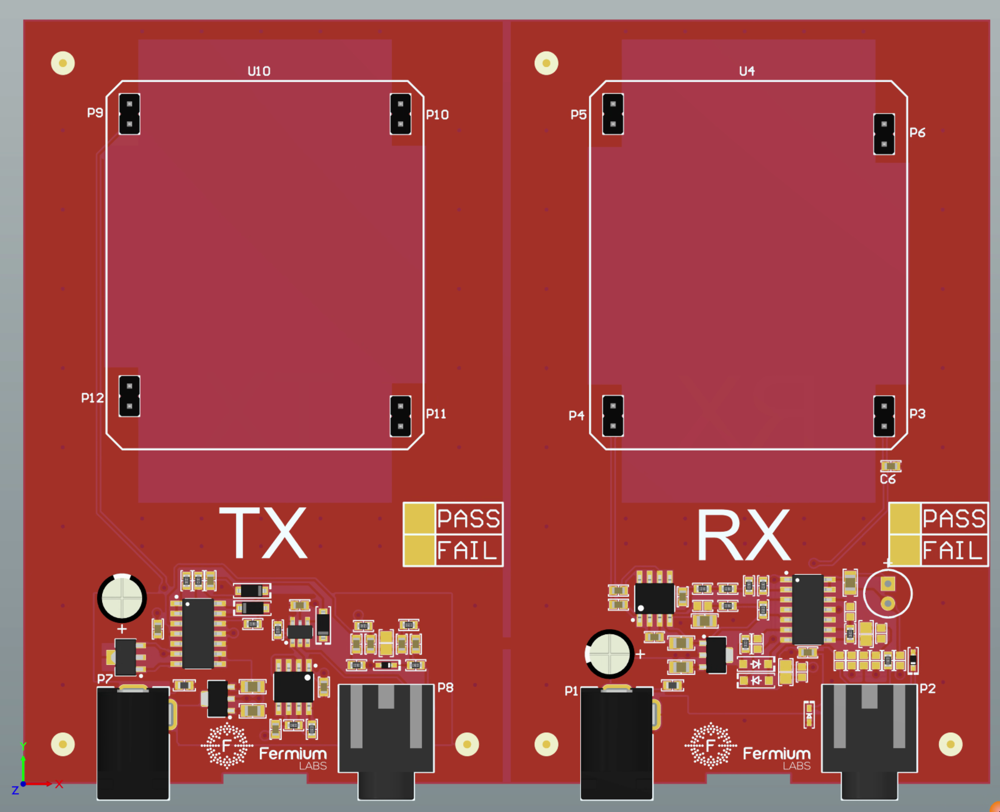

# Free Open Scientific Equipment

Fermium LTD announces the free release of all scientific equipment designs under the terms of the MIT license. You are free to use them as you wish.

## Why?

Our small business is no longer competitive in this sector, and thus we've ceased production of this scientific equipment.

## What's Included

- Microwave Optics Kit:
  - [Microwave RX and TX](https://github.com/Fermium/ltk-mw-electronic): A pair of ultra-low-cost 10GHz microwave transmitters and receivers
  - [Microwave Kit Display](https://github.com/Fermium/frm-mw-display)
  - [Diode Detector](https://github.com/Fermium/frm-mw-diode-detector): A 10GHz diode detector for studying evanescent waves and wave propagation in waveguides
  - [Mechanics](https://github.com/Fermium/ltk-mw-mechanics) including:
    - [Transmitter and Receiver](https://github.com/Fermium/ltk-mw-mechanics/tree/master/transmitter%20and%20receiver) with rear protractor
    - [Structure](https://github.com/Fermium/ltk-mw-mechanics/tree/master/structure) with feet, rulers, center protractor, and center mount
    - [PCB Optics Components](https://github.com/Fermium/ltk-mw-mechanics/tree/master/pcbs): Mirrors, polarizers, photon-sieves, Fresnel zone plates
    - [Waveguides](https://github.com/Fermium/ltk-mw-mechanics/tree/master/accessories/waveguides)

- Hall Effect Apparatus:
  - [Electronics](https://github.com/Fermium/ltk-hall-electronics) for the 2015, 2017, and 2019 models
  - [2015 Firmware](https://github.com/Fermium/Hall-firmware)
  - [2017 Firmware](https://github.com/Fermium/hall-firmware-v2#hall-effect-apparatus-firmware---2017)

# ltk-mw-electronics

A 10Ghz microwave transmitter and receiver for the Fermium LTD Microwave Optics Kit.

It uses a [New Japan Radio NJR4178](https://www.mouser.co.uk/ProductDetail/Nisshinbo/NJR4178?qs=d9U39LAeJF0rFkagUuXIpQ%3D%3D) doppler radar or alternatively a cheap 10Ghz radar of the same footprint that can be found on Aliexpress.

